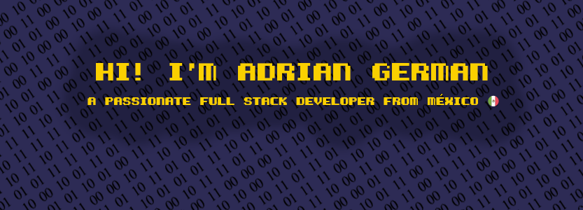

    

<h2 align="center">Know my portfolio</h2>

    

<h2 align="center">Connect with me</h2>

    
    
    

<h2 align="center">Languages and Tools ☕</h2>

    
    
    
    
    
    
    
    
    
    
    
    
    
    
    
    
    
    
    
    
    
    
    

<h2 align="center">My github stats🧃</h2>

